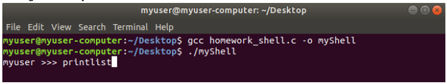

# CMPE 322 - OPERATING SYSTEMS
# PROJECT 1: Implementation of Your Own Shell
# (DUE DATE: 06.12.2019)

## 1. Introduction

In this project, you are going to implement your own shell (i.e. Command Line Interpreter) which is composed of a set of certain commands. The functionalities of these commands are already available within the default shell of your Linux-based OS. However, it is desired to implement a customized shell so that we can easily remember the commands and their corresponding functionalities. For example, even though you are experienced programmers and you know which command does which operation, it may be difficult to relate `ls` command to list the contents of the current directory. If the name of the command that provided this operation was `listdir`, life would be easier for the beginners.The aim of this project is developing a program to achieve the aforementioned objectives. You have to implement your project on a **Linux-based platform** by using the **GCC/G++ compiler**. Your code will be tested on a Linux machine, so that you can consider these requirements **as mandatory**, not optional. **It is allowed to use C or C++** of  the  main  programming  language  of  the  project implementation.

## 2. Details of Implementation

The shell program will be executed as a typical C/C++ program compiled via the terminal. In other words, it is not expected in this project that your shell program will automatically become active after opening a new terminal window by setting your shell program as the default shell through various settings on the system.

Depending on your design, whether it is a single file or multi file program, your program will be compiled and it is executed as a new process by the terminal. A sample execution of the process and initial prompt of your shell program should be the same as the one depicted in Figure 1. After a welcome message, the prompt should start with the current user name on the system (Watch out: Please do not provide the user name as hardcoded, because it will be tested on a separate machine!) , followed by `>>>` symbols. Please consider that there should be a single space between your username and `>>>` symbols. (Hint: you can check `whoami` command). Your shell program will be no different from the typical shell programs that exist on the system: the program waits for the command to be entered by the user, it is executed as soon as it is requested, and the program starts to wait for another command after the command is successfully completed. Your Shell program will continue to run until the interrupt signal or the `exit` command is entered. Here is the list of commands that should be available on your shell program (Note: The shell should take an input command from the user after putting a single space following the `>>>` sequence, as shown in the example usage below):

- `listdir`
  - This command will print out the contents of the current directory, same as the `ls` command in bash.
  - Example usage: `>>> listdir`
- `listdir -a`
  - The `listdir` command can take a flag if provided, as `-a` (as done with `ls -a`). This flag provides the opportunity of listing the directories or files that starts with `.`, which means that they are the hidden contents.
  - Example usage: `>>> listdir -a`
- `currentpath`
  - This command will print out the current working directory. This functionality is provided by the `pwd` command in most of the shells.
  - Example usage: `>>> currentpath`
- `printfile <fileName>`
  - This command will take a file name as an argument, read its content and write them on the standard output. This functionality is provided by the `cat` command in most of the shells. 
  - Example usage: `>>> printfile myText.c`
- `printfile <fileName> > <newFileName>`
  - This command will take a file name as an argument, and redirect the standard output to a new file using the redirection operator, `>`, (greater than symbol).  This functionality is provided by the `cat` command in most of the shells. 
  - Example usage: `>>> printfile myText.c > myTextNew.c`
- `footprint`
  - This  command  will  simply print up  to **maximum 15 commands** that  are executed before. The output will be the list of commands in which each line has a history number (starting with 1) and the corresponding command. This functionality is provided by the `history` command in most of the shells.
  - Example usage: `>>> footprint`
- `listdir | grep "<argument>"`
  - This  command  includes  pipe  between  to  processes.  The  output  of  the `listdir` command will be redirected to `grep`, and it will search for a pattern provided as the `<argument>`. Since you are already familiar with, `grep` command requires an input to search for a pattern, and that input should be provided by the output of the `listdir` command. 
  - This command should be also available for `listdir -a` command.
  - Example usage: `>>> listdir | grep “.c"`
  - Example usage: `>>> listdir -a | grep “.txt"`
- `exit`
  - Your shell process will be terminated after the user enters the `exit` command. 
  - Example usage: `>>> exit`

Your shell implementation should **only** consist of the set of commands that are presented above. The combinations that are not discussed **will not be tested or evaluated**.

Example cases that will not be evaluated:
- `printfile myProgram.c | grep “#include”` command will not be tested.
- single `grep` command without pipe does not have to be supported.
- `footprint | grep -i “txt”` with a single pipe or `footprint | grep -i “txt” | less` with multiple pipes  will not be tested.

The implementation details are up to you. You can use your own design as long as it provides the necessary functionalities. 

## 3. Submission Details

- You need to upload a **.zip** file on Moodle until the deadline specified at the top of this document **(06 December 2019,  23:55). Important  note: No .rar files  or other extensions are accepted**.
- Here is the late submission policy. If you submit within following 24 hours after the deadline, there will be **20 points penalty**. For another 24 hours will result in **30 points more penalty**. **No submissions will be accepted after the second day of the late submission**. Here are the numerical examples: If you submit your project between 06 December 2019 23:55 -07 December 2019 23:55, there will be 20 points penalty. If you submit your project between 07 December 2019 23:55 -08 December 2019 23:55, there will be 50 points penalty in total (20+30). Lastly, you cannot submit your project after 08 December 2019 23:55 (in other words, there will be 100 points penalty).
- *This is an individual assignment*; no group submission is allowed. **Plagiarism policy of the course applies for this project**, which means that your code will be analyzed for plagiarism. No excuses will be accepted.
- The  name  of  the  zipped  file  should  be **[StudentID].zip** without  the  brackets  (e.g., “2020123456.zip”). The files that must be included in the zipped file are:
  - Code files (C or C++)
  - A Makefile that creates an executable
- You should document your code. You don’t need to create an extra file for the documentation, your code should be commented as the documentation.
- Here is the grading policy:
  - Coding andimplementation (90%)
  - Code documentation (10%)
- If you conflict with any provided rules in this section, it will negatively affect your grade.
- Good luck!

